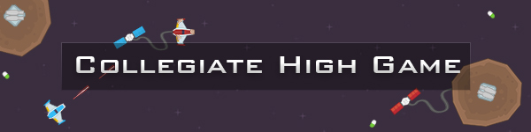
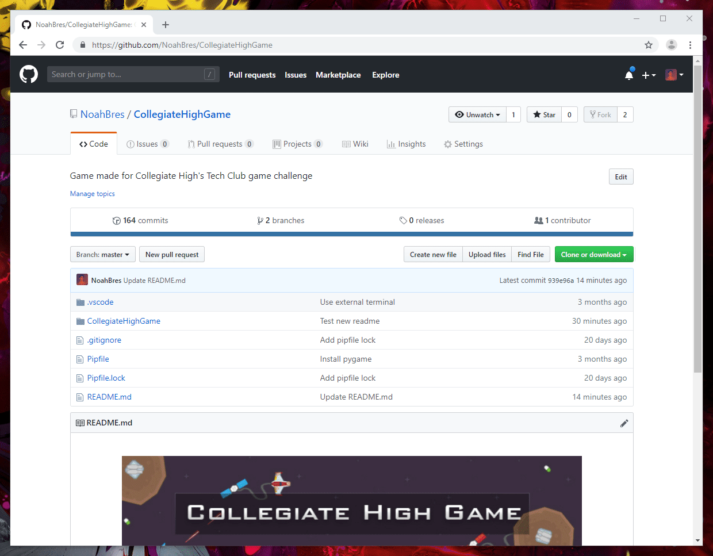
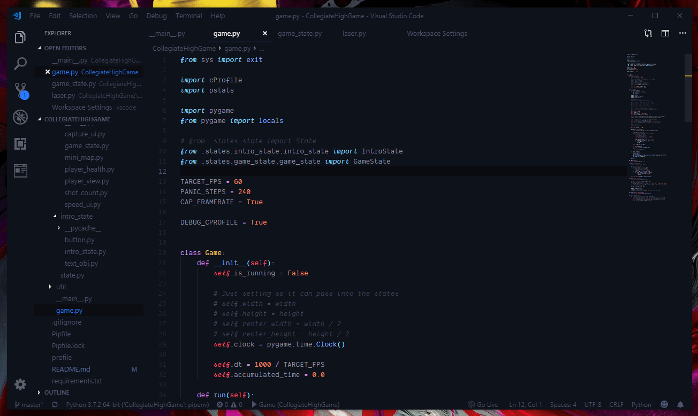

<p align="center">
    
</p>
<p align="center">
    <a href="#-what-is-it">What is it?</a> &mdash;
    <a href="#-demo">Demo</a> &mdash;
    <a href="#-download">Download</a> &mdash;
    <a href="#-install-packages">Install Packages</a> &mdash;
    <a href="#-run">Run</a>
</p>

## 🤷 What is it?

**Quick tl;dr:**

Collegiate High School's Tech Club hosted a game development competition (2019). The game was to be made in Python using the Pygame library. This is my project for the competition. It is far from a complete game. It mainly serves as a demo for what Tech Club does.

#### Game Details:

This game is essentially just a simple capture the flag game. The window is split in half, each player getting their own half. Each player has their own base with a "flag" (satellite) tethered to it. The goal is to capture the opponent's satellite and bring it to your own base.

## 🎮 Demo

> Test

## 🔨 Download

There are a few options to download and run the project.

### Option 1: Download from Github

Click the green download button near the top right and unzip the file.



### Option 2: Git clone

Recommended for most developers. Simply run:

```
$ git clone https://github.com/NoahBres/CollegiateHighGame.git
```

## 📦 Install Packages

If you're using pip:

```
$ pip install -r requirements.txt
```

If you're using pipenv

```
$ pipenv install
```

Congrats! The required packages are installed.

## 🐍 Run

From the root folder, run `python -m CollegiateHighGame`

### Optional: VSCode Debug

This git repo comes with a `launch.json` for VSCode users. This enables you to launc the program by simply pressing the green play button on VSCode's debug menu. Ignore if you aren't using Visual Studio Code. Otherwise, it's pretty snazzy.

