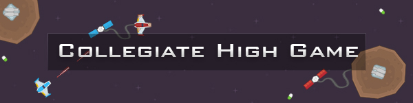

    

    <a href="#-what-is-it">What is it?</a> &mdash;
    <a href="#-download">Download</a> &mdash;
    <a href="#-install-packages">Install Packages</a> &mdash;
    <a href="#-run">Run</a> &mdash;
    <a href="#-demo">Demo</a>

## 🤷 What is it?

**Quick tl;dr:**

Collegiate High School's Tech Club hosted a game development competition (2019). The game was to be made in Python using the Pygame library. This is my project for the competition.
